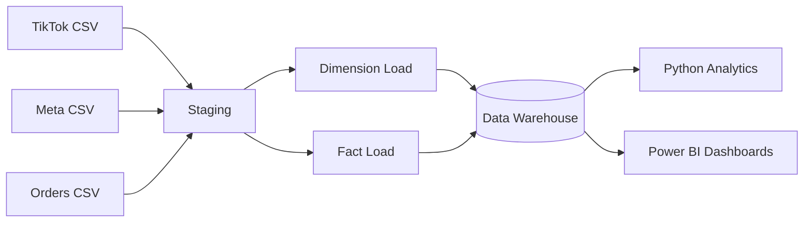

# Functional Specification (FS)
## Marketing Data Warehouse & BI Analytics Platform

---

# 1. Purpose

This Functional Specification describes the functional behavior, input/output rules, data flows, acceptance criteria, and system interactions for the Marketing Data Warehouse & BI Analytics Platform. It translates business requirements (BRD) into actionable technical specifications.

---

# 2. System Architecture (Functional View)

Raw Data (CSV)
↓
01 Staging Layer (SQLite)
↓
02 Data Warehouse (Star Schema)
↓
03 Analytics Layer (Python)
↓
04 Power BI Dashboards

---

# 3. Actors & Personas

| Actor | Description | Usage |
|-------|-------------|--------|
| Performance Marketer | Optimizes ads, reviews metrics | Filters campaigns, creatives |
| BI Analyst | Builds dashboards | Creates visuals & measures |
| Data Analyst | Performs EDA & ML | Python notebook |
| BA / Product Owner | Defines requirements | Reviews outputs |
| Leadership | Monitors business | Executive dashboard |

---

# 4. Functional Requirements (Detailed)

## 4.1 Data Ingestion

### FR-01 — Load Source Files
**Input:** TikTok, Meta, Orders CSV  
**Output:** Staging tables  
**Rules:**
- Columns must be trimmed, normalized, lowercased.
- Invalid rows flagged but still loaded.

### FR-02 — Schema Alignment
TikTok & Meta columns must be standardized into a unified structure.

---

## 4.2 Data Transformation

### FR-03 — Dimension Creation
Dimensions required:
- Platform  
- Campaign  
- Adset  
- Creative  
- Country  

### FR-04 — Surrogate Keys
Each dimension must generate:
- `*_key` INTEGER PRIMARY KEY AUTOINCREMENT

### FR-05 — Fact Table Creation
Fact table grain must be:
**date × platform × campaign × adset × creative × country**

Aggregated fields:
- impressions  
- clicks  
- spend  
- conversions  
- revenue  
- new_customers  

---

## 4.3 KPI Computation Logic

| KPI | Formula |
|-----|---------|
| CTR | clicks / impressions |
| CVR | conversions / clicks |
| CPC | spend / clicks |
| CPM | spend / (impressions / 1000) |
| ROAS | revenue / spend |
| CAC | spend / new_customers |

---

## 4.4 Business Logic

### BL-01: Creative Classification
Creatives are assigned categories:

| Condition | Category |
|----------|----------|
| ROAS > 3 and CTR > 3% | High Performer |
| ROAS > 2 | Good |
| CTR < 1% | Low CTR — Fix Hook |
| ROAS < 1 | Poor Performer |

### BL-02: Data Quality Flagging
Flag records where:
- clicks > impressions  
- spend = 0  
- conversions < 0  
- dimensions unmapped  

---

# 5. User Stories & Acceptance Criteria

### US-01: As a marketer, I want to view daily ROAS so I can adjust budgets.
**AC:**
- Dashboard displays daily trend  
- Drilldown available by platform  
- ROAS calculation validated  

### US-02: As a BI analyst, I want consistent KPI definitions.
**AC:**
- All KPIs documented  
- Single source of truth  
- No duplicated logic  

### US-03: As a data analyst, I want to perform EDA easily.
**AC:**
- Notebook loads DW in < 2 seconds  
- KPIs computed without errors  

### US-04: As leadership, I want a high-level view.
**AC:**
- Dashboard shows spend, revenue, ROAS, CAC  
- Refresh time < 5 seconds  

---

# 6. Entity Definitions

### Fact: fact_marketing_performance
Contains aggregated marketing performance metrics.

### Dimensions
- dim_campaign → campaign metadata  
- dim_adset → audience segment info  
- dim_creative → creative metadata  
- dim_country → geo-level segmentation  
- dim_platform → channel (TikTok/Meta)

---

# 7. Data Flow Diagram

# 8. Acceptance Criteria Summary

| Requirement                  | Must Pass? |
| ---------------------------- | ---------- |
| KPI calculations accurate    | Yes        |
| No duplicated dimension rows | Yes        |
| Fact table respects grain    | Yes        |
| Dashboards refresh < 5s      | Yes        |
| Data quality rules applied   | Yes        |

# 9. Constraints

Data size small (local SQLite)
No external API integrations
Requires Python environment for analytics

# 10. Glossary

| Term   | Definition                         |
| ------ | ---------------------------------- |
| ROAS   | Return on Ad Spend                 |
| CAC    | Customer Acquisition Cost          |
| CVR    | Conversion Rate                    |
| CTR    | Click Through Rate                 |
| Funnel | Impressions → Clicks → Conversions |

